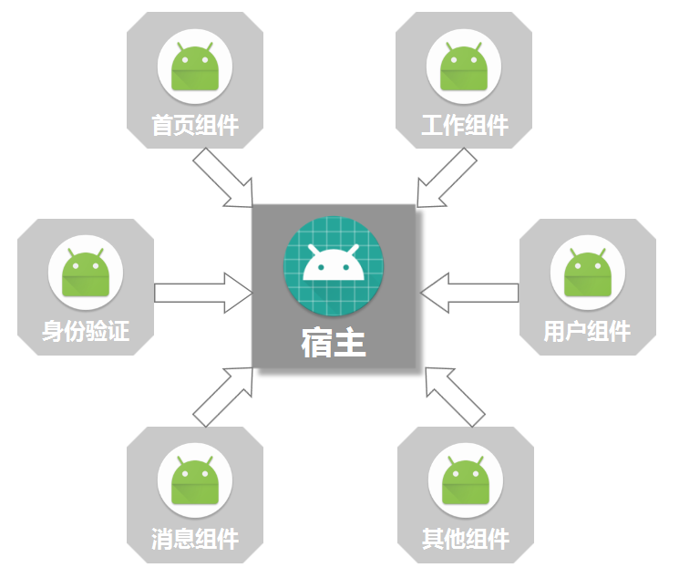
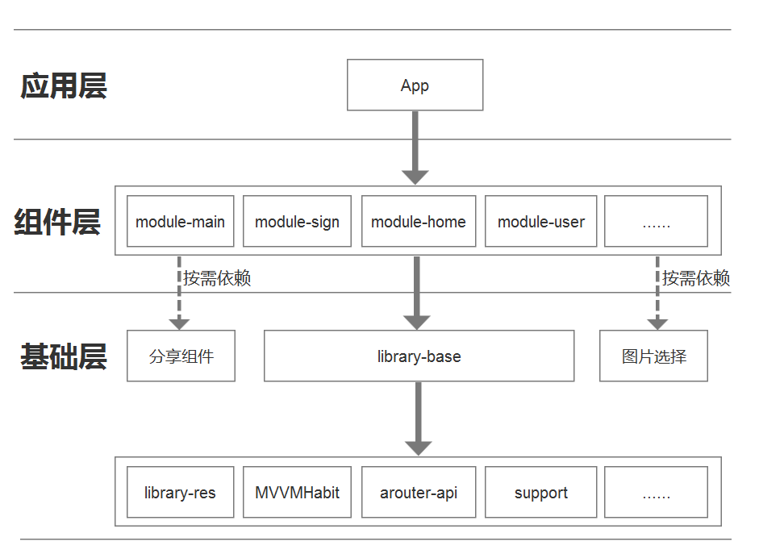
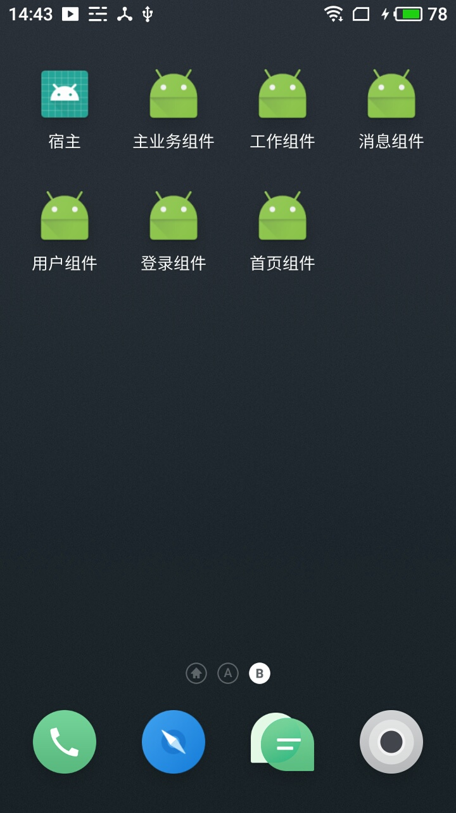
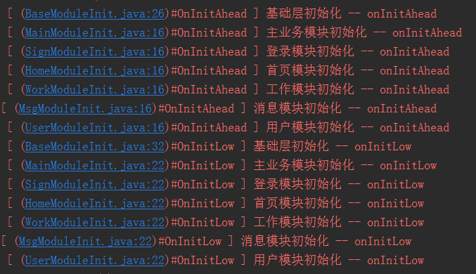
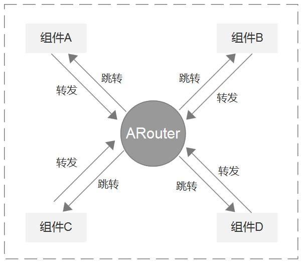

# MVVMHabitComponent
关于Android的组件化，相信大家并不陌生，网上谈论组件化的文章，多如过江之鲫，然而一篇基于MVVM模式的组件化方案却很少。结合自身的调研和探索，在此分享一篇基于[MVVMHabit](https://github.com/goldze/MVVMHabit)框架的一套Android-Databinding组件化开发方案。文章写的比较简单基础，没有大篇幅单向技术的讨论点，目的是让学习了此方案的开发人员都可以快速上手搭建MVVM组件化项目。

<a target="_blank" href="http://qm.qq.com/cgi-bin/qm/qr?k=Pvi-65bZN6fRly3VBC8F3fS7A-Pjinna"></a>
##
> **原文地址：** [https://github.com/goldze/MVVMHabitComponent](https://github.com/goldze/MVVMHabitComponent)
## 整体架构


## 1、浅谈

### 1.1、MVVM的优势
想必熟悉前端的朋友对MVVM非常了解，这种模式在目前web前端火的一塌糊涂，比如vue、angular、react都是采用MVVM设计模式实现的前端框架。而在Android开发中，MVVM并不是唯一的架构模式，最常用的可能是MVC模式（通常不是理想的实现）。比较流行的是MVP，它在某种程度上与MVVM模式非常相似。不过MVVM在MVP的基础上更进一步的提高了开发效率，拥有了数据绑定的能力。说到Android MVVM，很自然的联想到谷歌出的Databinding，它提供了xml与java的完美绑定，就像html与js的绑定一样。虽然Android端的MVVM还不是很火，但我相信它是一种趋势。趁着web前端MVVM的热度，移动前端也应该崛起了。
### 1.2、组件化开发
代码是死的，产品是活的。在日常开发中，各种各样频繁变动的需求，给开发上带来了不小的麻烦。为了尽量把代码写“活”，所以出现了设计模式。但光有设计模式，还是很难满足产品BT的需求。

对于简单的小项目，大多都采用的是单一工程，独立开发。由于项目不大，编译速度及维护成本这些也在接受范围之内。而对于做好一个App产品，这种多人合作、单一工程的App架构势必会影响开发效率，增加项目的维护成本。每个开发者都要熟悉如此之多的代码，将很难进行多人协作开发，而且Android项目在编译代码的时候电脑会非常卡，又因为单一工程下代码耦合严重，每修改一处代码后都要重新编译打包测试，导致非常耗时，最重要的是这样的代码想要做单元测试根本无从下手，所以必须要有更灵活的架构代替过去单一的工程架构。

使用组件化方案架构，高内聚，低耦合，代码边界清晰，每一个组件都可以拆分出来独立运行。所有组件寄托于宿主App，加载分离的各个组件，各自编译自己的模块，有利于多人团队协作开发。



### 1.3、MVVM模式 + 组件化
光说理论没用，来点实际的东西，这里要提两个重要的框架。

- **[MVVMHabit](https://github.com/goldze/MVVMHabit)**：基于谷歌最新AAC架构，MVVM设计模式的一套快速开发库，整合Okhttp+RxJava+Retrofit+Glide等主流模块，满足日常开发需求。使用该框架可以快速开发一个高质量、易维护的Android应用。</br>
- **[ARouter](https://github.com/alibaba/ARouter)**：阿里出的一个用于帮助 Android App 进行组件化改造的框架 —— 支持模块间的路由、通信、解耦。

**MVVMHabit + ARouter**：MVVM模式 + 组件化方案，前者是设计模式，后者是方案架构，两者并用，相得益彰。有这两个框架作支撑，事半功倍，可快速开发组件化应用。
## 2、项目搭建


### 2.1、创建项目
> 先把工程中最基本的架子创建好，再一步步将其关联起来
#### 2.1.1、创建宿主
搭建组件化项目与单一工程项目一样，先通过Android Studio创建一个常规项目。

**File->New->New Project...**

创建的这个项目将其定义为“ **宿主** ”(大多数人都是这种叫法)，也可以叫空壳项目。它没有layout，没有activity，它的职责是将分工开发的组件合而为一，打包成一个可用的Apk。

在宿主工程中，主要包含两个东西，一个是**AndroidManifest.xml**：配置application、启动页面等；另一个是**build.gradle**：负责配置构建编译/打包参数，依赖子模块。

#### 2.1.2、创建组件
所谓的组件，其实也就是一个Module，不过这个Module有点特殊，在合并打包的时候它是一个**library：apply plugin: ‘com.android.library’**，在独立编译运行的时候，它是一个**application：apply plugin: ‘com.android.application’**。

**File->New->New Module->Android Library...**

一般可以取名为**module-xxx(组件名)**

#### 2.1.3、创建Library
除了业务组件之外，还需要创建两个基础Library，**library-base** 和 **library-res**。

- **library-base**：存放一些公共方法、公共常量、组件通信的契约类等。上层被所有组件依赖，下层依赖公共资源库、图片选择库、路由库等通用库，通过它，避免了组件直接依赖各种通用库，承上启下，作为整个组件化的核心库。

- **library-res**：为了缓解base库的压力，专门分离出一个公共资源库，被base库所依赖，主要存放与res相关的公共数据，比如图片、style、anim、color等。

#### 2.1.4、第三方框架准备
还需要准备两个第三方的框架，即前面说的 **[MVVMHabit](https://github.com/goldze/MVVMHabit)** 和 **[ARouter](https://github.com/alibaba/ARouter)**，可使用远程依赖。

**MVVMHabit**：

```gradle
allprojects {
    repositories {
		...
        google()
        jcenter()
        maven { url 'https://jitpack.io' }
    }
}
```

```gradle
dependencies {
    ...
    implementation 'com.github.goldze:MVVMHabit:?'
}
```

**ARouter**：

```gradle
defaultConfig {
    ...
    javaCompileOptions {
        annotationProcessorOptions {
            arguments = [AROUTER_MODULE_NAME: project.getName()]
        }
    }
}
```

```gradle
dependencies {
    api 'com.alibaba:arouter-api:?'
    annotationProcessor 'com.alibaba:arouter-compiler:?'
}
```

### 2.2、组件分离
组件化其实是一个 **分离--组合** 的过程，分离是分离产品原型，组合是组合代码模块。拿到需求后，一定不要急着开干，首先将产品原型分离成一个个子原型，分工开发后，将编写完成的子业务模块又打包组合成一个完整的Apk。

最常见的应属这种底部几个tab的设计。


通过组件化，可以按照业务大致将项目拆分为：**首页模块**、**工作模块**、**消息模块**、**用户模块**，当然还可以再分细一点，比如用户模块再分离一个**身份验证模块**出来。拆分的越细，复用起来就越方便。

那么在上面2.1.2节创建组件时，则创建以下几个组件Module：**module-home**、**module-work**、**module-msg**、**module-user**、**module-sign**。
### 2.3、组件配置
> gradle是组件化的基石，想搭建好组件化项目，gradle知识一定要扎实（Android已经留下了gradle的烙印）。
#### 2.3.1、依赖关系
项目创建好后，需要将他们串联起来，组合在一起。依赖关系如下图所示：



宿主依赖业务组件
```gradle
dependencies {
    //主业务模块
    implementation project(':module-main')
    //身份验证模块
    implementation project(':module-sign')
    //首页模块
    implementation project(':module-home')
    //工作模块
    implementation project(':module-work')
    //消息模块
    implementation project(':module-msg')
    //用户模块
    implementation project(':module-user')
}
```
业务组件依赖library-base
```gradle
dependencies {
    //组件依赖基础库
    api project(':library-base')
	//按需依赖第三方组件
}
```
library-base依赖公共库
```gradle
dependencies {
    //support相关库
    api rootProject.ext.support["design"]
    api rootProject.ext.support["appcompat-v7"]
    //library-res
    api project(':library-res')
    //MVVMHabit框架
    api rootProject.ext.dependencies.MVVMHabit
    //ARouter框架
    api rootProject.ext.dependencies["arouter-api"]
    //其他公共库，例如图片选择、分享、推送等
}
```
#### 2.3.2、开启dataBinding
Android MVVM模式离不开DataBinding，每个组件中都需要开启，包括宿主App

```gradle
android {
    //开启DataBinding
    dataBinding {
        enabled true
    }
}
```

#### 2.3.3、模式开关
需要一个全局变量来控制当前运行的工程是隔离状态还是合并状态。在gradle.properties中定义：

```gradle
isBuildModule=false
```
isBuildModule 为 true 时可以使每个组件独立运行，false 则可以将所有组件集成到宿主 App 中。

#### 2.3.4、debug切换
在组件的build.gradle中动态切换library与application

```gradle
if (isBuildModule.toBoolean()) {
    //作为独立App应用运行
    apply plugin: 'com.android.application'
} else {
    //作为组件运行
    apply plugin: 'com.android.library'
}
```
当　isBuildModule 为 true 时，它是一个application，拥有自己的包名

```gradle
android {
    defaultConfig {
        //如果是独立模块，则使用当前组件的包名
        if (isBuildModule.toBoolean()) {
            applicationId 组件的包名
        }
    }
}
```
#### 2.3.5、manifest配置
组件在自己的AndroidManifest.xml各自配置，application标签无需添加属性，也不需要指定activity的intent-filter。当合并打包时，gradle会将每个组件的AndroidManifest合并到宿主App中。
```xml
<manifest xmlns:android="http://schemas.android.com/apk/res/android"
    package="com.goldze.main">
    <application>
        ...
    </application>
</manifest>
```
组件独立运行时，就需要单独的一个AndroidManifest.xml作为调试用。可以在src/main文件夹下创建一个alone/AndroidManifest.xml。配置application标签属性，并指定启动的activity。

```xml
<manifest xmlns:android="http://schemas.android.com/apk/res/android"
    package="com.goldze.main">
    <application
        ...
        >
        <activity 
            ...
            >
            <intent-filter>
                ...
            </intent-filter>
        </activity>
    </application>
</manifest>
```
并在build.gradle中配置

```gradle
android {
    sourceSets {
        main {
            ...
            if (isBuildModule.toBoolean()) {
                //独立运行
                manifest.srcFile 'src/main/alone/AndroidManifest.xml'
            } else {
                //合并到宿主
                manifest.srcFile 'src/main/AndroidManifest.xml'
                resources {
                    //正式版本时，排除alone文件夹下所有调试文件
                    exclude 'src/main/alone/*'
                }
            }
        }
    }
}
```
#### 2.3.6、统一资源
在组件的build.gradle配置统一资源前缀

```gradle
android {
    //统一资源前缀，规范资源引用
    resourcePrefix "组件名_"
}
```
#### 2.3.7、配置抽取
可以将每个组件的build.gradle公共部分抽取出一个module.build.gradle

```gradle
if (isBuildModule.toBoolean()) {
    //作为独立App应用运行
    apply plugin: 'com.android.application'
} else {
    //作为组件运行
    apply plugin: 'com.android.library'
}
android {
    ...
    defaultConfig {
        ...
        //阿里路由框架配置
        javaCompileOptions {
            annotationProcessorOptions {
                arguments = [AROUTER_MODULE_NAME: project.getName()]
            }
        }
    }
    sourceSets {
        main {
            if (isBuildModule.toBoolean()) {
                //独立运行
                manifest.srcFile 'src/main/alone/AndroidManifest.xml'
            } else {
                //合并到宿主
                manifest.srcFile 'src/main/AndroidManifest.xml'
                resources {
                    //正式版本时，排除alone文件夹下所有调试文件
                    exclude 'src/main/alone/*'
                }
            }
        }
    }
    buildTypes {
        ...
    }
    dataBinding {
        enabled true
    }
}
```

组件中引入module.build.gradle即可

```gradle
apply from: "../module.build.gradle"
android {
    defaultConfig {
        //如果是独立模块，则使用当前组件的包名
        if (isBuildModule.toBoolean()) {
            applicationId 组件的包名
        }
    }
    //统一资源前缀，规范资源引用
    resourcePrefix "组件名_"
}
dependencies {
    ...
}
```

### 2.4、完成
运行效果如下：



到此为止，一个最基本的组件化工程搭建完毕。

## 3、可行性方案
### 3.1、组件初始化
> 组件在独立运行时，也就是debug期，有单独的manifest，当然也就可以指定Application类进行初始化。那么当组件进行合并的时，Application只能有一个，并且存在宿主App中，组件该如何进行初始化？
#### 3.1.1、反射
反射是一种解决组件初始化的方法。

在library-base下定义一个 **[ModuleLifecycleConfig](https://github.com/goldze/MVVMHabitComponent/blob/master/library-base/src/main/java/com/goldze/base/config/ModuleLifecycleConfig.java)** 单例类，主要包含两个公共方法：initModuleAhead(先初始化)、initModuleLow(后初始化)。

**为何这里要定义两个初始化方法？**

组件多了，必定会涉及到初始化的先后顺序问题，组件中依赖的第三方库，有些库需要尽早初始化，有些可以稍晚一些。比如ARouter的init方法，官方要求尽可能早，那么就可以写在library-base初始化类的onInitAhead中，优先初始化。

```java
@Override
public boolean onInitAhead(Application application) {
    KLog.init(true);
    //初始化阿里路由框架
    if (BuildConfig.DEBUG) {
        ARouter.openLog();     // 打印日志
        ARouter.openDebug();   // 开启调试模式(如果在InstantRun模式下运行，必须开启调试模式！线上版本需要关闭,否则有安全风险)
    }
    ARouter.init(application); // 尽可能早，推荐在Application中初始化
    return false;
}
```

再定义一个组件生命周期管理类 **[ModuleLifecycleReflexs](https://github.com/goldze/MVVMHabitComponent/blob/master/library-base/src/main/java/com/goldze/base/config/ModuleLifecycleReflexs.java)** ，在这里注册组件初始化的类名全路径，通过反射动态调用各个组件的初始化方法。

**注意：组件中初始化的Module类不能被混淆**

#### 3.1.2、初始化接口
定义一个 **[IModuleInit](https://github.com/goldze/MVVMHabitComponent/blob/master/library-base/src/main/java/com/goldze/base/base/IModuleInit.java)**
接口，动态配置Application，需要初始化的组件实现该接口，统一在宿主app的Application中初始化
```java
public interface IModuleInit {
    //初始化优先的
    boolean onInitAhead(Application application);

    //初始化靠后的
    boolean onInitLow(Application application);
}
```

#### 3.1.3、初始化实现
反射类和接口都有了，那么在各自的组件中创建一个初始化类，实现IModuleInit接口。最后在宿主的Application中调用初始化方法

```java
@Override
public void onCreate() {
    super.onCreate();
    //初始化组件(靠前)
    ModuleLifecycleConfig.getInstance().initModuleAhead(this);
    //....
    //初始化组件(靠后)
    ModuleLifecycleConfig.getInstance().initModuleLow(this);
}
```

最后即实现组件的初始化效果



**小优化：** 当组件独立运行时，宿主App不会执行onCreate方法，但是组件业务又需要初始化单独调试。常规做法是组件中单独定义Application，但这样每个组件都需要创建一个Application，比较繁琐。我们有了上述的初始化方法，可以在 **library-base** 中定义一个 **DebugApplication** ，debug包下的代码不参与编译，仅作为独立模块运行时初始化数据。最后记得在组件的调试版alone/AndroidManifest下指定为base中的 **DebugApplication**。

### 3.2、组件间通信
> 组件间是完全无耦合的存在，但是在实际开发中肯定会存在业务交叉的情况，该如何实现无联系的组件间通信呢？
#### 3.2.1、ARouter
**[ARouter](https://github.com/alibaba/ARouter)** 之所以作为整个组件化的核心，是因为它拥有强大的路由机制。ARouter在library-base中依赖，所有组件又依赖于library-base，所以它可以看作为组件间通信的桥梁。



在组件A中跳转到组件B页面：

```java
ARouter.getInstance()
    .build(router_url)
    .withString(key, value)
    .navigation();
```
在组件B页面中接收传过来的参数：

```java
@Autowired(name = key)
String value;
```

更多ARouter用法：**[https://github.com/alibaba/ARouter/blob/master/README_CN.md](https://github.com/alibaba/ARouter/blob/master/README_CN.md)**
#### 3.2.2、事件总线(RxBus)
**[MVVMHabit](https://github.com/goldze/MVVMHabit)** 中提供了RxBus，可作为全局事件的通信工具（跨进程失效）。

当组件B页面需要回传数据给组件A时，可以调用：

```java
_Login _login = new _Login();
RxBus.getDefault().post(_login);
```

在组件A中注册接收(注册在调用之前完成)：

```java
subscribe = RxBus.getDefault().toObservable(_Login.class)
    .subscribe(new Consumer<_Login>() {
        @Override
        public void accept(_Login l) throws Exception {
            //登录成功后重新刷新数据
            initData();
            //解除注册
            RxSubscriptions.remove(subscribe);
        }
    });
RxSubscriptions.add(subscribe);
```

### 3.3、base规范
**library-base** 有两个主要作用：一是依赖通用基础jar或第三方框架，二是存放一些公共的静态属性和方法。下面列举一些基础通用类的约定规范。
#### 3.3.1、config
在base的config包下面，统一存放全局的配置文件，比如组件生命周期初始化类：**ModuleLifecycleConfig、ModuleLifecycleReflexs**，网络ROOT_URL，SD卡文件读写目录等。
#### 3.3.2、contract
RxBus组件通信，需要经过base层，统一规范。那么可以在contract包下面定义RxBus的契约类，写好注释，便于其他组件开发人员使用。
#### 3.3.3、global
主要存放全局的Key，比如 **IntentKeyGlobal：** 存放组件间页面跳转传参的Key名称； **SPKeyGlobal：** 全局SharedPreferences Key 统一存放在这里。单个组件中内部的key可以另外在单独组件中定义。
#### 3.3.4、router
**ARouter** 路由@Route注解中Path可以单独抽取一个或者两个RouterPath类出来，比如定义一个RouterActivityPath：

```java
public class RouterActivityPath {
    /**
     * 主业务组件
     */
    public static class Main {
        private static final String MAIN = "/main";
        /*主业务界面*/
        public static final String PAGER_MAIN = MAIN +"/Main";
    }
```

Activity的路由路径统一在此类中定义，并使用静态内部类分块定义各个组件中的路径路由。
## 4、总结


还是得总结一下。

> 项目组件化，就好比制造业，生活中的绝大多数工业产品。比如汽车，由发动机、轮子、引擎等各个重要零件拼装而成。同样，我们的app也是由各个组件并联起来，形成一个完整可执行的软件。它的精髓就是这么3点：独立、完整、自由组合。
> 而且组件化甚至都不算是人类的发明。即使放在自然界，这也是早已存在的模式。想想我们人体多么复杂，绝对不亚于windows操作系统。但除去几个非常重要的数器官之外，大多部分损坏或缺失，我们都能活下来。这不得不说是组件化的奇迹。

写软件一定要注重架构，不要等到代码越写越烂，越烂越写，最后连自己都看不下去了才想到去重构。组件化是一个很好隔离每个业务模块的方案，即使其中一个组件出了问题，也不用像单一工程那样整体地去调试。配合MVVM设计模式，使得我们工作中的具体项目变得更轻、好组装、编译构建更快，不仅提高工作效率，同时自我对移动应用开发认知有进一步的提升。组件化框架具有通用性，特别适用于业务模块迭代多，量大的大中型项目，是一个很好的解决方案。

Android架构的演进，由 **模块化** 到 **组件化** 再到 **插件化**。我们在组件化开发的道路上，尽可能的完善组件开发规范，丰富组件功能库，有一些粒度大的业务组件可以进一步的细化，对组件功能进行更单一的内聚，同时基于现有的组件化框架，便于过度在未来打造插件化框架。

**QQ交流群**：84692105

## License

    Copyright 2018 goldze(曾宪泽)
 
    Licensed under the Apache License, Version 2.0 (the "License");
    you may not use this file except in compliance with the License.
    You may obtain a copy of the License at
 
        http://www.apache.org/licenses/LICENSE-2.0
 
    Unless required by applicable law or agreed to in writing, software
    distributed under the License is distributed on an "AS IS" BASIS,
    WITHOUT WARRANTIES OR CONDITIONS OF ANY KIND, either express or implied.
    See the License for the specific language governing permissions and
    limitations under the License.